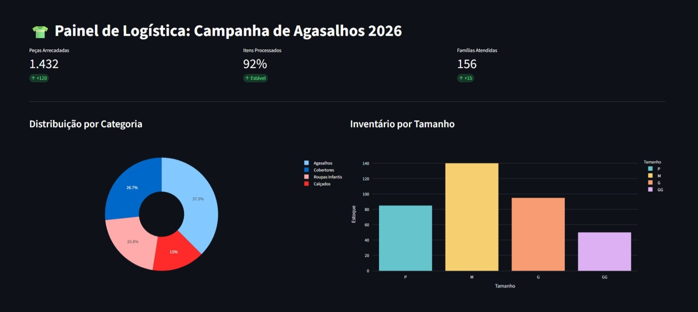

# projeto-logistica-agasalhos
# 🚚 Painel Logístico de Arrecadação - Campanha 2026

Este projeto foi desenvolvido para monitorar em tempo real a logística e as metas da Campanha de Agasalhos, utilizando ferramentas modernas de análise de dados.

## 📊 Visualização do Dashboard

## 🛠️ Tecnologias e Habilidades
* **Python & Pandas**: Processamento e estruturação de dados de inventário.
* **Streamlit**: Desenvolvimento da interface interativa.
* **Git/GitHub**: Controle de versão e documentação de portfólio.

## 📈 Resultados Monitorados
* **1.432 peças** arrecadadas até o momento.
* **156 famílias** atendidas pela logística do projeto.
